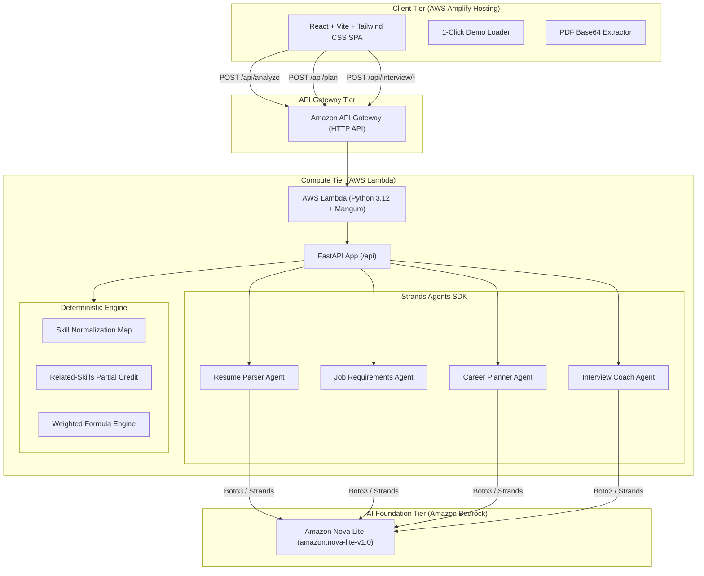

# HireReady AI 🎯
> **Your AI Placement Copilot**  

[](https://aws.amazon.com/)
[](https://aws.amazon.com/bedrock/)
[](https://github.com/strands-agents)
[](https://fastapi.tiangolo.com/)
[](https://vitejs.dev/)
[-brightgreen?logo=pytest)](https://pytest.org/)

---

## 📌 Problem & Hackathon Context

Engineering students apply to hundreds of tech internships and placement opportunities without clarity on:
1. **How their resume truly compares** to specific role requirements.
2. **What technical gaps they have**, and why those gaps matter.
3. **What concrete steps to take next** to close those gaps in a realistic timeline.
4. **How to handle technical interview questions** specifically targeting their weaknesses.

Existing ATS checkers give opaque, arbitrary percentage scores without actionable evidence. **HireReady AI** delivers a transparent, deterministic placement match score, explicit evidence extracted directly from the candidate's resume, an actionable 4-week learning roadmap with a recommended capstone project, and an AI interview practice round with instant scored feedback.

---

## 💡 Solution Overview

HireReady AI acts as a 24/7 personal placement mentor:
- **Zero Hallucination Scoring**: Skill match scoring is 100% deterministic (plain Python engine) with strict weights and alias normalization. No arbitrary LLM "score guesses".
- **Evidence-Based Gap Breakdown**: Every missing or partial skill is cited with direct quotes or explicit `"not found in resume"` notices.
- **Actionable 4-Week Roadmap**: Converts skill gaps into a structured week-by-week study plan with estimated time commitments and concrete deliverables.
- **Capstone Project Recommendation**: Recommends a single, high-impact resume project specifically designed to demonstrate missing competencies to recruiters.
- **AI Interview Practice Round**: Generates 5 tailored interview questions across Resume, Technical, DSA, Project, and Behavioral categories, evaluates student answers out of 10, highlights strengths & weaknesses, and provides a model answer.

---

## 🎨 Frontend & UX

The React + Vite + Tailwind SPA follows a clean, light-first design system with a reusable component library (`frontend/src/components/ui/`: Button, Card, Badge, Chip, Input, Textarea, ProgressBar, Skeleton) and the self-hosted Inter typeface.

- **Light / Dark mode**: A header toggle switches themes. The choice persists in `localStorage` and falls back to the OS `prefers-color-scheme`. An inline pre-paint script in `index.html` applies the saved theme before React mounts, so there's no flash of the wrong theme.
- **Compact input screen**: A single card holds both the résumé and job-description inputs, with the primary action inside the card and helper text that explains what's still required while the button is disabled.
- **Friendly error handling**: API failures are mapped to plain-language messages by type — network/unreachable, timeout (30s request budget via `AbortController`), invalid input (surfacing the backend's specific 400 detail), and server error — each shown in a banner with a **Retry** action instead of raw strings like "Bad Gateway".
- **Backend status**: A health check runs on load; a warning appears in the header **only when the backend is unreachable** (clicking it rechecks), keeping the UI uncluttered when everything is healthy.

---

## 🏗️ Architecture

HireReady AI is built with a serverless, stateless architecture hosted on AWS.



---

### Model Provider Selection

Amazon Bedrock (Amazon Nova Lite) is the **default provider and is what the deployed Lambda always uses**. Alternative providers are opt-in for local development only and activate solely when `MODEL_PROVIDER` is set explicitly:

| `MODEL_PROVIDER` | Provider used | Intended for |
|------------------|---------------|--------------|
| _(unset)_ | **Amazon Bedrock — Nova Lite** | Production Lambda + default local dev |
| `groq` | Groq (OpenAI-compatible) | Local dev without Bedrock access |
| `openai` | OpenAI | Local dev without Bedrock access |

The mere presence of a `GROQ_API_KEY` or `OPENAI_API_KEY` does **not** switch providers, so a stray key can never override Bedrock in the deployed environment. All agent calls go through a shared `run_agent_with_retry` helper (`backend/src/utils/agent_runner.py`) with exponential backoff on rate limits, a single schema-correction retry on malformed output, and a ~20s total time budget so a request never approaches the API Gateway 29-second timeout.

---

## ☁️ Why AWS Services?

| AWS Service | Why We Chose It |
|-------------|-----------------|
| **AWS Lambda** | Stateless execution, zero idle cost, scales instantly with incoming student requests, natively packages Python 3.12 runtimes. |
| **Amazon API Gateway (HTTP API)** | Low latency, low cost compared to REST APIs, built-in CORS and payload throttling to protect compute budgets. |
| **Amazon Bedrock (Nova Lite)** | Lowest latency and token cost ($0.06/1M input, $0.24/1M output), robust support for JSON structured output, enterprise-grade data privacy. |
| **AWS Amplify Hosting** | Instant global edge CDN distribution for Vite single-page applications, simple CI/CD or drag-and-drop artifact deployments. |
| **AWS Strands Agents SDK** | Official lightweight agentic SDK designed for Bedrock, supporting type-safe Pydantic output parsing and clean prompt separation. |

---

## 🔬 Scoring Engine Formula

The match score is completely transparent and explainable:

$$\text{Score} = \frac{\sum (\text{weight} \times \text{credit})}{\sum \text{weight}} \times 100$$

- **Skill Weights**:
  - `Required Skill`: weight = $2.0$
  - `Preferred / Nice-to-Have Skill`: weight = $1.0$
- **Credits Awarded**:
  - `Exact Match`: credit = $1.0$ (direct evidence found in resume)
  - `Partial Credit`: credit = $0.5$ (related experience found, e.g. Docker-Compose for Docker, or S3/EC2 for AWS)
  - `Missing`: credit = $0.0$ (`"not found in resume"`)
- **Disclaimer**:
  > *"This score is an estimate based on resume evidence, not a hiring prediction."*

---

## 🚀 Getting Started Locally

### Prerequisites
- Python 3.12 or 3.13
- Node.js 18+ and npm
- AWS Account with Bedrock model access (Amazon Nova Lite enabled) — the default provider
- _Optional:_ a Groq or OpenAI key for local dev without Bedrock (see "Model Provider Selection" above and `.env.example`)

> Commands below are written for **Windows PowerShell**. Run the backend and the frontend in **two separate terminals**.

### 1. Clone the Repository
```powershell
git clone https://github.com/dhanush017/hireready.git
cd hireready
```

### 2. Backend Setup (Terminal 1)
```powershell
cd backend
python -m venv .venv
.\.venv\Scripts\Activate.ps1
pip install -r requirements.txt
pip install pytest

# Run the unit test suite (55 tests)
python -m pytest tests -v
```

**Environment variables** (backend). None are required to start the server — Amazon Bedrock is the default. Set these only for the noted cases (names only; put real values in a gitignored `.env`, never commit them):

| Variable | Required? | Purpose |
|----------|-----------|---------|
| `MODEL_PROVIDER` | No | Leave unset for Bedrock (default). Set to `groq` or `openai` for local dev without Bedrock. |
| `AWS_REGION` | For Bedrock | AWS region for Bedrock (defaults to `us-east-1`). |
| `BEDROCK_MODEL_ID` | No | Overrides the default `amazon.nova-lite-v1:0`. |
| `GROQ_API_KEY` | If `MODEL_PROVIDER=groq` | Groq API key. |
| `GROQ_MODEL_ID` / `GROQ_MAX_TOKENS` | No | Groq model overrides. |
| `OPENAI_API_KEY` | If `MODEL_PROVIDER=openai` | OpenAI API key. |
| `CORS_ORIGIN` | No | Allowed browser origin (defaults to `*`). |

To use Bedrock you need working AWS credentials (e.g. `aws configure`, or `AWS_ACCESS_KEY_ID` / `AWS_SECRET_ACCESS_KEY` in your environment). For local dev without Bedrock, copy `.env.example` to `.env`, set `MODEL_PROVIDER=groq`, and provide `GROQ_API_KEY`.

Start the backend server (stays running in this terminal):
```powershell
python -m uvicorn src.handler:app --reload --port 8000
```
The API is now at `http://127.0.0.1:8000`. Verify it: open `http://127.0.0.1:8000/api/health` — it should return `{"status":"healthy",...}`.

### 3. Frontend Setup (Terminal 2)
```powershell
cd frontend
npm install
npm run dev
```
Open **`http://localhost:5173`** in your browser.

**How the frontend finds the backend.** In dev, the Vite server (`vite.config.ts`) proxies every `/api/*` request to `http://127.0.0.1:8000`, so the frontend calls relative paths and **no frontend environment variable is needed** — just start the backend on port 8000 first. Only when pointing the frontend at a remote/deployed backend do you set `VITE_API_BASE_URL` (e.g. in `frontend/.env`) to that backend's base URL; leave it unset for local development.

---

## 🧪 Test Suite Results

The deterministic scoring engine, schema validation, and agent-runner retry/backoff logic are covered by 55 unit tests:
```text
============================= test session starts =============================
platform win32 -- Python 3.13.2, pytest-9.1.1, pluggy-1.6.0
collected 55 items

backend/tests/test_agent_runner.py::TestErrorClassification ....       [  7%]
backend/tests/test_agent_runner.py::TestRateLimitBackoff .             [  9%]
backend/tests/test_agent_runner.py::TestSchemaCorrection .             [ 10%]
backend/tests/test_agent_runner.py::TestNonRetryable .                 [ 12%]
backend/tests/test_agent_runner.py::TestTimeBudget ..                  [ 16%]
backend/tests/test_aliases.py::TestNormalizeSkill .............        [ 40%]
backend/tests/test_schemas.py::TestResumeProfile ...                   [ 45%]
backend/tests/test_schemas.py::TestJobRequirements .                  [ 47%]
backend/tests/test_schemas.py::TestSkillMatch ..                       [ 50%]
backend/tests/test_schemas.py::TestAnalyzeRequest ..                   [ 54%]
backend/tests/test_schemas.py::TestPlanResult .                        [ 56%]
backend/tests/test_schemas.py::TestInterviewSchemas ....               [ 63%]
backend/tests/test_scoring.py::TestMatchSkills .............           [ 87%]
backend/tests/test_scoring.py::TestCalculateScore .......              [100%]

============================= 55 passed in 0.24s ==============================
```

---

## 🎬 3-Minute Demo Walkthrough

1. **Load Realistic Demo Data**: Click `"Load demo (B.Tech CSE vs SWE Intern)"` to populate sample student Aarav Sharma's credentials and CloudScale Tech's Software Engineer Intern JD.
2. **Analyze Match**: Click `"Analyze match & gaps"`. Observe real-time progress steps showing PDF parsing, Strands Bedrock agents, and deterministic scoring.
3. **Inspect Match Score & Gaps**: Review the 71% match score, matched skills (C++, Python, SQL, Git), partial credits (AWS / Docker), and missing competencies with actionable fixes.
4. **4-Week Curriculum & Capstone Project**: Explore the structured roadmap and recommended portfolio project (*"Distributed Rate-Limited Task Queue"*).
5. **Interactive Interview Practice**: Click `"Practice Interview"`. Answer targeted questions, submit, and receive scored AI evaluations (/10) with strengths, improvements, and exemplar answers.

---

## 🔒 Security & Reliability
- **Data Privacy**: Resumes are processed strictly as data, never as prompt instructions; resume contents are never written to disk or logs.
- **Safety Limits**: Strict 2 MB PDF limit and input truncation to prevent prompt injection and model overflow.
- **Stateless Resilience**: Zero database dependencies; client manages state between idempotent REST calls.

---

## 🛣️ Future Roadmap (v2)
- Multi-resume comparison across different company applications.
- Audio speech-to-text input for real mock voice interview rounds.
- PDF export of personalized 4-week study syllabus.
