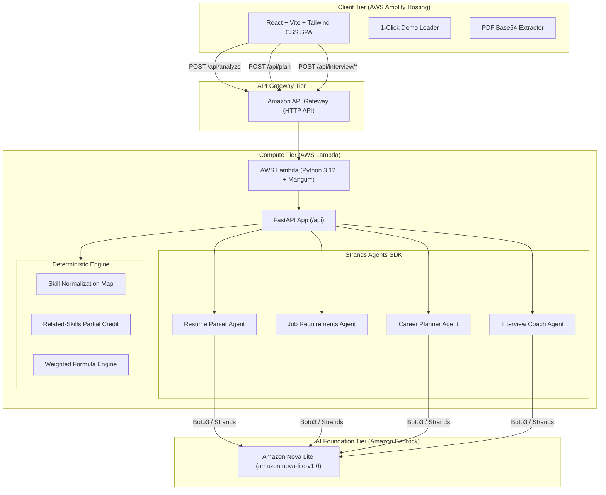

# HireReady AI 🎯
> **Your AI Placement Copilot**  
> Built for the WeMakeDevs "First Commit" Hackathon (Ship It Track)

[](https://aws.amazon.com/)
[](https://aws.amazon.com/bedrock/)
[](https://github.com/strands-agents)
[](https://fastapi.tiangolo.com/)
[](https://vitejs.dev/)
[-brightgreen?logo=pytest)](https://pytest.org/)

---

## 📌 Problem & Hackathon Context

Engineering students apply to hundreds of tech internships and placement opportunities without clarity on:
1. **How their resume truly compares** to specific role requirements.
2. **What technical gaps they have**, and why those gaps matter.
3. **What concrete steps to take next** to close those gaps in a realistic timeline.
4. **How to handle technical interview questions** specifically targeting their weaknesses.

Existing ATS checkers give opaque, arbitrary percentage scores without actionable evidence. **HireReady AI** delivers a transparent, deterministic placement match score, explicit evidence extracted directly from the candidate's resume, an actionable 4-week learning roadmap with a recommended capstone project, and an AI interview practice round with instant scored feedback.

---

## 💡 Solution Overview

HireReady AI acts as a 24/7 personal placement mentor:
- **Zero Hallucination Scoring**: Skill match scoring is 100% deterministic (plain Python engine) with strict weights and alias normalization. No arbitrary LLM "score guesses".
- **Evidence-Based Gap Breakdown**: Every missing or partial skill is cited with direct quotes or explicit `"not found in resume"` notices.
- **Actionable 4-Week Roadmap**: Converts skill gaps into a structured week-by-week study plan with estimated time commitments and concrete deliverables.
- **Capstone Project Recommendation**: Recommends a single, high-impact resume project specifically designed to demonstrate missing competencies to recruiters.
- **AI Interview Practice Round**: Generates 5 tailored interview questions across Resume, Technical, DSA, Project, and Behavioral categories, evaluates student answers out of 10, highlights strengths & weaknesses, and provides a model answer.

---

## 🏗️ Architecture

HireReady AI is built with a serverless, stateless architecture hosted on AWS.



---

## ☁️ Why AWS Services?

| AWS Service | Why We Chose It |
|-------------|-----------------|
| **AWS Lambda** | Stateless execution, zero idle cost, scales instantly with incoming student requests, natively packages Python 3.12 runtimes. |
| **Amazon API Gateway (HTTP API)** | Low latency, low cost compared to REST APIs, built-in CORS and payload throttling to protect compute budgets. |
| **Amazon Bedrock (Nova Lite)** | Lowest latency and token cost ($0.06/1M input, $0.24/1M output), robust support for JSON structured output, enterprise-grade data privacy. |
| **AWS Amplify Hosting** | Instant global edge CDN distribution for Vite single-page applications, simple CI/CD or drag-and-drop artifact deployments. |
| **AWS Strands Agents SDK** | Official lightweight agentic SDK designed for Bedrock, supporting type-safe Pydantic output parsing and clean prompt separation. |

---

## 🔬 Scoring Engine Formula

The match score is completely transparent and explainable:

$$\text{Score} = \frac{\sum (\text{weight} \times \text{credit})}{\sum \text{weight}} \times 100$$

- **Skill Weights**:
  - `Required Skill`: weight = $2.0$
  - `Preferred / Nice-to-Have Skill`: weight = $1.0$
- **Credits Awarded**:
  - `Exact Match`: credit = $1.0$ (direct evidence found in resume)
  - `Partial Credit`: credit = $0.5$ (related experience found, e.g. Docker-Compose for Docker, or S3/EC2 for AWS)
  - `Missing`: credit = $0.0$ (`"not found in resume"`)
- **Disclaimer**:
  > *"This score is an estimate based on resume evidence, not a hiring prediction."*

---

## 🚀 Getting Started Locally

### Prerequisites
- Python 3.12 or 3.13
- Node.js 18+ and npm
- AWS Account with Bedrock model access (Amazon Nova Lite enabled) or mock mode

### 1. Clone the Repository
```bash
git clone https://github.com/your-org/hireready.git
cd hireready
```

### 2. Backend Setup
```bash
cd backend
pip install -r requirements.txt
pip install pytest pypdf mangum strands-agents

# Run unit test suite (46 tests)
python -m pytest tests -v
```

Run the backend server locally:
```bash
uvicorn src.handler:app --reload --port 8000
```

### 3. Frontend Setup
```bash
cd ../frontend
npm install
npm run build
npm run dev
```
Open `http://localhost:5173` in your browser.

---

## 🧪 Test Suite Results

The deterministic scoring engine and schema validation are covered by 46 unit tests:
```text
============================= test session starts =============================
platform win32 -- Python 3.13.2, pytest-9.1.1, pluggy-1.6.0
collected 46 items

backend/tests/test_aliases.py::TestNormalizeSkill .............        [ 28%]
backend/tests/test_schemas.py::TestResumeProfile ...                   [ 34%]
backend/tests/test_schemas.py::TestJobRequirements .                  [ 36%]
backend/tests/test_schemas.py::TestSkillMatch ..                       [ 41%]
backend/tests/test_schemas.py::TestAnalyzeRequest ..                   [ 45%]
backend/tests/test_schemas.py::TestPlanResult .                        [ 47%]
backend/tests/test_schemas.py::TestInterviewSchemas ....               [ 56%]
backend/tests/test_scoring.py::TestMatchSkills .............           [ 84%]
backend/tests/test_scoring.py::TestCalculateScore .......              [100%]

============================= 46 passed in 1.00s ==============================
```

---

## 🎬 3-Minute Demo Walkthrough

1. **Load Realistic Demo Data**: Click `"Load Demo (B.Tech CSE vs SWE Intern)"` to populate sample student Aarav Sharma's credentials and CloudScale Tech's Software Engineer Intern JD.
2. **Analyze Match**: Click `"Analyze Match & Gap Breakdown"`. Observe real-time progress steps showing PDF parsing, Strands Bedrock agents, and deterministic scoring.
3. **Inspect Match Score & Gaps**: Review the 71% match score, matched skills (C++, Python, SQL, Git), partial credits (AWS / Docker), and missing competencies with actionable fixes.
4. **4-Week Curriculum & Capstone Project**: Explore the structured roadmap and recommended portfolio project (*"Distributed Rate-Limited Task Queue"*).
5. **Interactive Interview Practice**: Click `"Practice Interview"`. Answer targeted questions, submit, and receive scored AI evaluations (/10) with strengths, improvements, and exemplar answers.

---

## 🔒 Security & Reliability
- **Data Privacy**: Resumes are processed strictly as data, never as prompt instructions; resume contents are never written to disk or logs.
- **Safety Limits**: Strict 2 MB PDF limit and input truncation to prevent prompt injection and model overflow.
- **Stateless Resilience**: Zero database dependencies; client manages state between idempotent REST calls.

---

## 🛣️ Future Roadmap (v2)
- Multi-resume comparison across different company applications.
- Audio speech-to-text input for real mock voice interview rounds.
- PDF export of personalized 4-week study syllabus.
